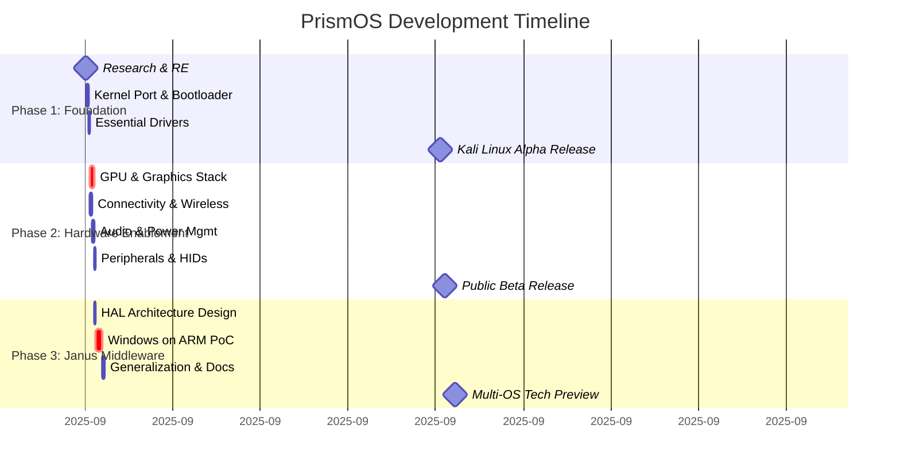

# PrismOS Installer

   

The PrismOS Installer is a community-driven project that extends the groundbreaking work of **Asahi Linux** to bring full-featured Linux distributions to the very latest Apple Silicon hardware, including the M1, M2, M3, and M4 families.

---

### Standing on the Shoulders of Giants

> This project would be entirely impossible without the monumental reverse-engineering efforts of the **Asahi Linux team**, led by Hector Martin (@marcan) and many other talented developers.
>
> **PrismOS is not a fork.** It is an extension of the official Asahi installer, modified to recognize the latest hardware identifiers before they are officially supported. All credit for the core technology—the `m1n1` bootloader, the custom kernel, the drivers, and the ingenious installation strategy—belongs entirely to the Asahi Linux project.
>
> We are immensely grateful for their open-source philosophy. We strongly encourage you to follow and **[support the official Asahi Linux project](https://asahilinux.org/support/)**.

---

## ✨ Features

-   **Broad Hardware Support**: Provides an installation path for all Apple Silicon chips, from **M1 to M4**.
-   **User-Friendly**: A simple, one-line command kicks off a guided command-line interface.
-   **Safe & Non-Destructive**: Installs alongside macOS without removing it. The installer safely resizes your existing macOS partition.
-   **Firmware Extraction**: Automatically extracts the necessary firmware from your macOS installation to make hardware like Wi-Fi and Bluetooth work correctly.

## ⚙️ How It Works

Installing Linux on Apple Silicon is a complex, two-stage process that the installer automates.

### Stage 1: The macOS Installer

The first stage runs entirely within your existing macOS environment.

1.  **Bootstrap**: The initial `curl` command downloads a bootstrap script.
2.  **Download & Extract**: The bootstrap script downloads the main Python installer application and extracts it to a temporary directory.
3.  **System Analysis**: The Python app starts and gathers information about your Mac, including its Chip ID and Device Class, to ensure it's compatible.
4.  **Partitioning**: It guides you through resizing your main macOS APFS container to free up space.
5.  **Stub OS Creation**: The installer creates a new, minimal "stub" macOS installation in the free space. This stub OS acts as a custom bootloader environment.
6.  **Blessing**: It "blesses" the stub OS, setting it as the default boot volume for the *next* boot only.
7.  **Reboot Prompt**: The installer then instructs you to shut down and boot into the Startup Options menu.

### Stage 2: The Recovery Environment

The second stage finalizes the security setup from within the special stub OS recovery mode.

# **PrismOS Development Roadmap**

## **Project Vision**

To create a seamless and high-performance multi-boot environment on Apple Silicon hardware. PrismOS will not just be an operating system, but an underlying enablement layer that first perfects the Linux experience (specifically Debian/Kali) and then evolves into a revolutionary abstraction middleware, allowing other ARM-based operating systems to run with near-native hardware access.

-----

## **Phase 1: Core Bootstrapping & Kernel Foundation (Focus: Debian/Kali)**

**Objective:** Achieve a stable, bootable Debian-based system (Kali Linux) on Apple Silicon, establishing a solid foundation for all future work. This phase focuses on essential functionality.

  * **Epic 1.1: Environment Setup & Reverse Engineering**

      * `[ ]` Establish a dedicated build and development environment.
      * `[ ]` Deep analysis of Apple's boot process (Boot ROM, LLB, iBoot).
      * `[ ]` In-depth reverse engineering of Apple Silicon's proprietary hardware interfaces, building on the work of the Asahi Linux project.
      * `[ ]` Document the memory-mapped I/O (MMIO) registers for core components.

  * **Epic 1.2: Custom Bootloader & Kernel Port**

      * `[ ]` Develop a custom bootloader (`m1n1` stage) capable of initializing the hardware.
      * `[ ]` Fork the Linux kernel and begin porting efforts for the M-series SoC.
      * `[ ]` Implement the initial Apple Interrupt Controller (AIC) driver.
      * `[ ]` Develop basic PCIe support for internal device communication.
      * `[ ]` Create a minimal, bootable Debian `debootstrap` image with a custom kernel.

  * **Epic 1.3: Essential Driver Implementation**

      * `[ ]` Implement a basic framebuffer driver for native display output (no acceleration).
      * `[ ]` Develop a driver for NVMe storage to access the internal SSD.
      * `[ ]` Enable USB-C / Thunderbolt controllers for basic keyboard, mouse, and external device support.
      * `[ ]` Ensure stable multi-core CPU support (SMP) with correct power management states.

  * **Epic 1.4: Kali Linux Integration**

      * `[ ]` Create a dedicated PrismOS repository to host the custom kernel and drivers.
      * `[ ]` Build a custom Kali Linux ARM64 image that integrates the PrismOS kernel and packages.
      * `[ ]` Test and validate core Kali toolchains (Metasploit, Nmap, Wireshark, etc.) on the new platform.
      * `[ ]` Release an initial "Developer Alpha" of Kali Linux for PrismOS.

-----

## **Phase 2: Full Hardware Enablement & System Integration**

**Objective:** Achieve full hardware potential, making the OS feel native, powerful, and stable. The goal is to match or exceed the performance and functionality of macOS on its own hardware.

  * **Epic 2.1: Graphics & Display Subsystem**

      * `[ ]` Reverse engineer the Apple AGX GPU architecture.
      * `[ ]` Develop a custom DRM/KMS (Direct Rendering Manager / Kernel Mode Setting) driver.
      * `[ ]` Write a Mesa Gallium3D driver for OpenGL 3.3+ and Vulkan 1.2+ hardware acceleration.
      * `[ ]` Implement support for display brightness control and multi-monitor output.

  * **Epic 2.2: Connectivity & Wireless**

      * `[ ]` Reverse engineer and develop drivers for the Broadcom "FullMAC" Wi-Fi and Bluetooth chipsets.
      * `[ ]` Extract and manage the necessary firmware blobs.
      * `[ ]` Ensure stable, high-performance networking and seamless Bluetooth device pairing.

  * **Epic 2.3: Human Interface Devices (HID) & Peripherals**

      * `[ ]` Develop drivers for the built-in keyboard and trackpad (using SPI).
      * `[ ]` Implement full support for the Touch Bar and ambient light sensor.
      * `[ ]` **[Stretch Goal]** Investigate secure access to the Touch ID sensor via the Secure Enclave (requires significant security research).
      * `[ ]` Develop drivers for the webcam (ISP - Image Signal Processor) and microphones.

  * **Epic 2.4: Audio & Power Management**

      * `[ ]` Reverse engineer the custom audio DSPs and speaker amplifiers.
      * `[ ]` Write a full ALSA (Advanced Linux Sound Architecture) driver for speakers and microphones.
      * `[ ]` Implement advanced power management: CPU frequency scaling, sleep/wake functionality, and accurate battery life reporting.

  * **Epic 2.5: System Polishing & Installer**

      * `[ ]` Develop a user-friendly, dual-boot installer that can resize APFS containers safely.
      * `[ ]` Create a "Hardware Control Center" for managing Mac-specific features.
      * `[ ]` Establish a continuous integration (CI/CD) pipeline for kernel and driver builds.
      * `[ ]` Launch a "Public Beta" program to gather widespread feedback and bug reports.

-----

## **Phase 3: The Abstraction Layer - "Janus" Middleware**

**Objective:** Create a revolutionary hardware abstraction middleware, codenamed "Janus." This layer will translate generic ARM driver calls from other operating systems (like Windows on ARM) to the specific driver implementation for Apple Silicon, enabling multi-OS support without porting every driver from scratch.

  * **Epic 3.1: Janus HAL Architecture & Design**

      * `[ ]` Define the Janus Hardware Abstraction Layer (HAL) API specifications. This API will expose standardized interfaces for GPU, Storage, Networking, etc.
      * `[ ]` Design the translation architecture. This will be a "shim" that sits between a guest OS kernel and the PrismOS host kernel.
      * `[ ]` Research existing paradigms (e.g., WSL2's Hyper-V approach, Android's HAL) for inspiration.

  * **Epic 3.2: Windows on ARM (WoA) Proof of Concept**

      * `[ ]` Develop a para-virtualized "Janus ACPI" driver to translate Windows power management and device discovery calls.
      * `[ ]` Create a "Janus StorPort Miniport" driver that maps Windows storage requests to the PrismOS NVMe driver.
      * `[ ]` Write a "Janus WDDM" (Windows Display Driver Model) graphics driver that translates DirectX/D3D calls into Vulkan calls for the native GPU driver.
      * `[ ]` Achieve a successful boot of the Windows on ARM kernel in a lightweight virtualized environment using the Janus HAL.

  * **Epic 3.3: Generalizing Janus for Other OSes**

      * `[ ]` Document the Janus HAL for other open-source developers.
      * `[ ]` Develop a reference "VirtIO-Janus" backend to allow any standard VirtIO-compliant OS to leverage the hardware acceleration provided by Janus.
      * `[ ]` Explore support for other ARM-based OSes (e.g., FreeBSD, other Linux distributions) through the standardized interface.

## **Visual Project Timeline (Gantt Chart)**

